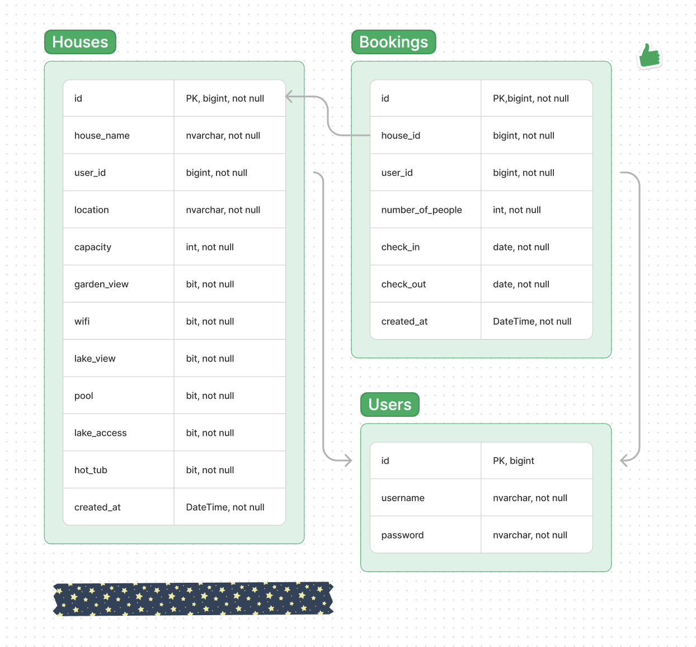

# Houses Api 
## _NET Core Web Api_
### Azure Demo
You can try this api using the link below
https://houseapidemo.azurewebsites.net/swagger/index.html

You need to have a token to booking, you can use this informations to get that token
- username: koray
- password: koray123

## _Er Diagram_

## _Assumptions and Design Choices_
- JWT (JSON Web Token) is used for user authentication. Assumes JWT tokens are passed as query parameters for authentication. Bareer
- Swagger UI is integrated for API documentation.
- .NET Core Web Api
- Azure Sql Database
- Azure Cloud Servis 
## _Check List For COMMON REQUIREMENTS_
- [x] Every student will do their own midterm, no groups
- [] All REST services must be versionable
- [] At least one service must support paging
- [x] For authentication, JWT or Oauth can be implemented. 
- [x] Must have Swagger UI or document
- [x] You can make assumptions as long as you document them
- [x] use a database service from any cloud service you like -> Azure Sql Database
(preferably Azure + 10 points).
- [x] Use a cloud service (+10 points) -> Azure Web App Cloud

## _Development_
I share appsettings file on github because azure services need my own ip and account and also I'm using VaultKey to protect my database

## _Presentation Video_
